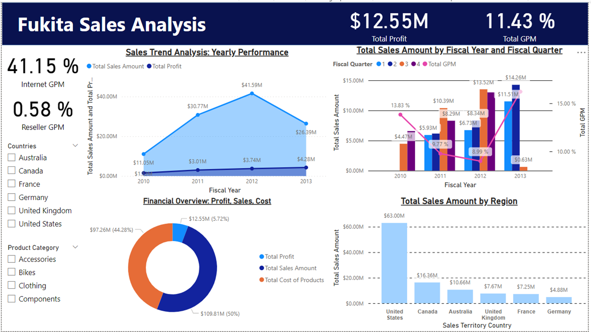
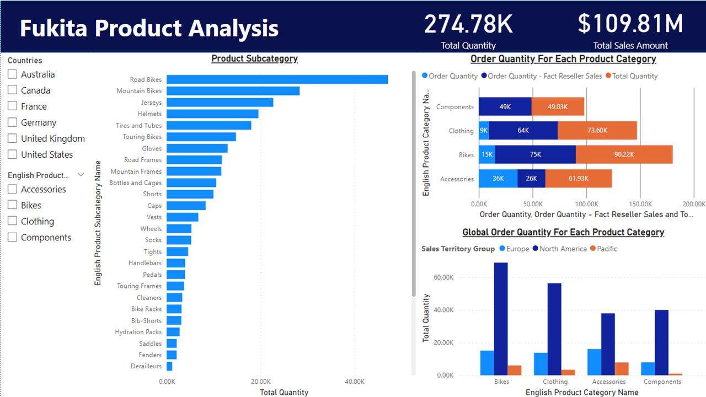

# Fukita Corporation: A Business Intelligence Analysis of Sales and Product Performance

## 📌 Project Overview
This project implements a complete Business Intelligence (BI) system for **Fukita Corporation**, a leading bicycle manufacturer founded in 2002. The goal is to analyze global business performance across **reseller and internet sales channels** to drive strategic decision-making, optimize sales strategies, and identify market opportunities.

By leveraging the company's data warehouse, this analysis delivers insights into **sales trends**, **customer behavior**, and **product performance**, presented through **two interactive Power BI dashboards**.

---

## 🔍 Methodology: CRISP-DM

This project follows the **CRISP-DM** (Cross-Industry Standard Process for Data Mining) methodology:

- **Business Understanding**  
  Defined the goal of using data-driven insights to improve Fukita’s global business performance, focusing on sales channels and product profitability.

- **Data Understanding**  
  Identified key tables including `FactResellerSales`, `FactInternetSales`, `DimProduct`, and `DimCustomer`.

- **Data Preparation**  
  Integrated multiple sources, cleaned data inconsistencies and missing values, and engineered features to support analysis.

- **Modeling**  
  Created a multi-dimensional data cube using **SSAS** in Visual Studio. Defined key metrics using **MDX**.

- **Evaluation**  
  Validated insights through Power BI visualizations against business objectives.

- **Deployment**  
  Deployed as **two interactive Power BI dashboards** for business stakeholder use.

---

## 🧱 BI Solution Architecture

| Component | Tool/Technology |
|----------|-----------------|
| **Data Source** | Microsoft SQL Server |
| **Data Modeling** | SSAS (SQL Server Analysis Services) in Visual Studio |
| **Calculations** | MDX (Multi-Dimensional Expressions) |
| **Visualization** | Microsoft Power BI |

---

## 📊 Dashboards & Key Insights

### 1️⃣ Fukita Sales Analysis Dashboard

**Timeframe:** 2010–2013  
**Key Highlights:**

- **Total Profit:** $12.55M  
- **Gross Profit Margin (GPM):** 11.43% overall  
- **Internet Sales GPM:** 41.15%  
- **Reseller Sales GPM:** 0.58%  
- **Sales Peak:** $41.59M in 2012  
- **Sales Decline:** $26.39M in 2013  
- **Top Market:** United States ($63.00M)  
- **Seasonal Trend:** Strong Q4 sales every year

---

### 2️⃣ Fukita Product Analysis Dashboard

**Key Highlights:**

- **Total Quantity Sold:** 274.78K units  
- **Total Revenue:** $109.81M  
- **Top Category:** Bikes (90.22K units)  
- **Top Subcategories:** Road Bikes & Mountain Bikes  
- **Key Market for Bikes:** Europe

---

## ✅ Strategic Recommendations

- **Enhance Internet Sales:**  
  Invest in digital marketing and UX to grow the high-GPM online channel.

- **Reassess Reseller Strategy:**  
  Improve GPM through better agreements, support, or cost controls.

- **Double Down on Key Markets:**  
  Focus efforts on the United States and tailor regional strategies, especially in Europe.

- **Leverage Q4 Trends:**  
  Align promotional campaigns with seasonal sales peaks.

---

## 📁 How to View the Dashboards
### Option 1: View Here
1. Fukita Sales Analysis Dashboard

2. Fukita Product Analysis Dashboard

### Option 2: Instructions to Open the File
1. Ensure you have **Microsoft Power BI Desktop** installed.  
2. **Download** the `.pbix` file from this repository.  
3. **Open** the file using Power BI Desktop to interact with the dashboards.

---

## 👨‍💻 Author

**Lee Wen Kang**  
[Connect on LinkedIn](https://www.linkedin.com/in/lee-wen-kang-3b76b6188/)

---
